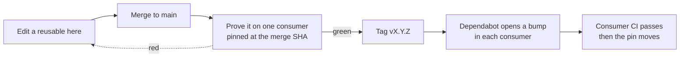

# .github

Org-wide defaults inherited by every Glyndor repository that doesn't define its
own: community-health files (SECURITY, CONTRIBUTING, CODE_OF_CONDUCT, SUPPORT,
FUNDING), issue/PR templates, the org profile, and reusable CI workflows.

## Reusable CI workflows

```yaml
# .github/workflows/ci.yml in any Glyndor repository
jobs:
  rust:
    uses: Glyndor/.github/.github/workflows/rust-ci.yml@<sha> # v1.7.0
    with:
      coverage-threshold: 70
```

- **CI:** `rust-ci`, `bun-ci`, `go-ci`, `python-ci`, `shell-ci`
- **Supply chain:** `rust-audit`, `rust-supply-chain`, `rust-debian`, `go-audit`
- **Fuzz:** `rust-fuzz`, `go-fuzz`
- **Release contracts:** `installer-contract`
- **Policy gates:** `dco`, `main-guard`, `line-limit`

Pin to a release **commit SHA** with the version in a comment. Dependabot bumps
it when a newer release ships. Allowed action sources: `actions/*`, `Glyndor/*`,
and `oven-sh/setup-bun` (needed by `bun-ci`).

## How a change reaches a repository



The SHA pin is the buffer: a change here never reaches a repository until that
repository's own CI has passed on it. Tag only after a real consumer is green,
because a tag is immutable and reaches the whole organisation at once.

## Versioning

Releases are semver tags on `main`: **major** for a breaking change to a
reusable's inputs or behavior, **minor** for additive changes, **patch** for
fixes.
