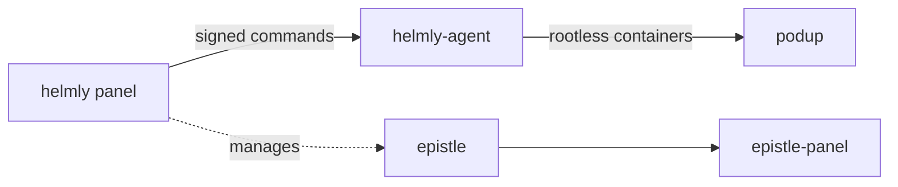

# Glyndor

### Secure, self-hosted infrastructure you actually own.

Open-source, security-first tools for self-hosters and teams — hardened,
lightweight, and built to OWASP ASVS Level 3.

&nbsp;
&nbsp;
&nbsp;

[**glyndor.net**](https://glyndor.net)&nbsp; · &nbsp;[**Support**](https://glyndor.net/support)&nbsp; · &nbsp;[**Security**](https://github.com/Glyndor/.github/security/policy)

---

## 🖥️ The platform

<table>
<tr>
<td valign="top" width="50%">

### 🖥️ [helmly](https://github.com/Glyndor/helmly)
Self-hosted hosting panel — firewall, SSH, containers and WireGuard tunnels. One server or a hardened fleet. A cPanel / Plesk / Coolify alternative.

  

</td>
<td valign="top" width="50%">

### 🛡️ [helmly-agent](https://github.com/Glyndor/helmly-agent)
Hardened per-server agent — runs Ed25519-signed commands and reports telemetry over WireGuard + mTLS.

 

</td>
</tr>
<tr>
<td valign="top" width="50%">

### 📦 [podup](https://github.com/Glyndor/podup)
`docker-compose` translated to rootless Podman — Rust library and a drop-in CLI.

 

</td>
<td valign="top" width="50%"></td>
</tr>
</table>

## ✉️ Mail

<table>
<tr>
<td valign="top" width="50%">

### ✉️ [epistle](https://github.com/Glyndor/epistle)
Self-hosted mail server — SMTP, IMAP and modern email security behind an API and CLI. Standalone or panel-integrated.

 

</td>
<td valign="top" width="50%">

### 📬 [epistle-panel](https://github.com/Glyndor/epistle-panel)
Next.js admin UI for the mail server — domains, mailboxes, security and queues on top of the mail API.

 

</td>
</tr>
</table>

## 🧰 Developer tools

<table>
<tr>
<td valign="top" width="50%">

### 🔐 [authcore](https://github.com/Glyndor/authcore)
Drop-in auth for Go — Argon2id passwords, EdDSA JWTs with refresh rotation, opaque API keys, OIDC + OAuth2. Zero boilerplate.

 

</td>
<td valign="top" width="50%">

### ⚡ [unitpm](https://github.com/Glyndor/unitpm)
Fast, secure process manager for Linux — the zero-overhead, systemd-native alternative to PM2.

 

</td>
</tr>
<tr>
<td valign="top" width="50%">

### 🗄️ [klyradb](https://github.com/Glyndor/klyradb)
Desktop app to manage isolated PostgreSQL, MySQL, MariaDB and Redis instances on Linux — DBngin for Ubuntu.

 

</td>
<td valign="top" width="50%"></td>
</tr>
</table>

## 🧩 Browser extensions

<table>
<tr>
<td valign="top" width="50%">

### 🧩 [specio](https://github.com/Glyndor/specio)
Detects the tech a site is built with — CMS, frameworks, analytics, CDNs, servers, fonts. An open Wappalyzer alternative.

 

</td>
<td valign="top" width="50%">

### 🎬 [viden](https://github.com/Glyndor/viden)
Detects and downloads the video playing on a page — including hidden or obscured streams (MP4, HLS, DASH).

 

</td>
</tr>
</table>

## 🔭 How it fits together

## 🛡️ Principles

**Secure by default** — the most restrictive config ships active.&nbsp; **You own it** — native binaries, no SaaS lock-in.&nbsp; **Open source** — every project public and Apache-2.0.&nbsp; **Minimal & native** — small binaries, audited supply chain.

## 🤝 Contributing

**Issues** are open to everyone. **Pull requests** are invitation-only — this code touches kernel-level surfaces (SSH, firewall, ports). Report vulnerabilities privately via [`SECURITY.md`](https://github.com/Glyndor/.github/blob/main/SECURITY.md); flow and conventions in [`CONTRIBUTING.md`](https://github.com/Glyndor/.github/blob/main/CONTRIBUTING.md).

---

Built in the open · <a href="https://glyndor.net">glyndor.net</a>

