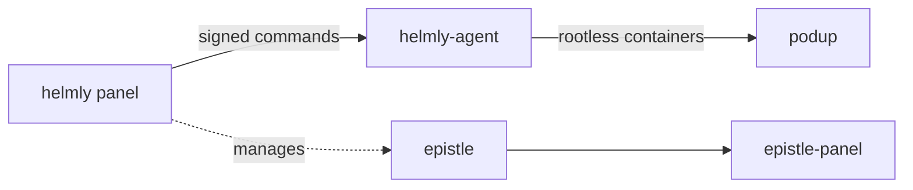

<div align="center">


# Glyndor

### Secure, self-hosted infrastructure you actually own.

Open-source, security-first tools for self-hosters and teams who want control
without trading away safety — hardened, lightweight, and built to
[OWASP ASVS Level 3](https://owasp.org/www-project-application-security-verification-standard/).

[**glyndor.net**](https://glyndor.net) · [Support](https://glyndor.net/support) · [Security policy](https://github.com/Glyndor/.github/security/policy)

</div>

---

```console
$ whoami
Glyndor — open-source infrastructure, secure by default.

$ ls ./projects
helmly/   epistle/   podup/   authcore/   unitpm/   klyradb/   specio/   viden/

$ cat ./principles
secure-by-default  ·  you-own-it  ·  open-source  ·  minimal-and-native
```

## 🖥️ The platform

Run a single server or a hardened fleet — the panel, its agents, and the
container layer that powers them.

| Project | What it is | Status |
|---|---|---|
| [**helmly**](https://github.com/Glyndor/helmly) | Self-hosted hosting panel — firewall, SSH, containers and WireGuard tunnels, single server or fleets. A cPanel / Plesk / Coolify alternative. | 🟡 In development |
| └ [helmly-agent](https://github.com/Glyndor/helmly-agent) | Hardened per-server agent — Ed25519-signed commands and telemetry over WireGuard + mTLS. | 🟢 Released · <!-- v:Glyndor/helmly-agent -->v1.3.1<!-- /v --> |
| [**podup**](https://github.com/Glyndor/podup) | `docker-compose` translated to rootless Podman — Rust library + drop-in CLI. | 🟢 Released · <!-- v:Glyndor/podup -->v1.8.0<!-- /v --> |

## ✉️ Mail

A headless mail server and the panel that drives it.

| Project | What it is | Status |
|---|---|---|
| [**epistle**](https://github.com/Glyndor/epistle) | Self-hosted mail server — SMTP, IMAP and modern email security behind an API and CLI. Standalone or integrated with the panel. | 🟢 Released · <!-- v:Glyndor/epistle -->v0.3.4<!-- /v --> |
| └ [epistle-panel](https://github.com/Glyndor/epistle-panel) | Next.js admin UI — domains, mailboxes, security and queues on top of the mail API. | 🟡 In development |

## 🧰 Developer tools

Standalone tools that stand on their own — drop one into your stack.

| Project | What it is | Status |
|---|---|---|
| [**authcore**](https://github.com/Glyndor/authcore) | Drop-in auth for Go — Argon2id passwords, EdDSA JWTs with refresh rotation, opaque API keys, OIDC + OAuth2. Secure by default, zero boilerplate. | 🟢 Released · <!-- v:Glyndor/authcore -->v1.11.2<!-- /v --> |
| [**unitpm**](https://github.com/Glyndor/unitpm) | Fast, secure process manager for Linux — the zero-overhead, systemd-native alternative to PM2. | 🟡 In development |
| [**klyradb**](https://github.com/Glyndor/klyradb) | Desktop app to manage isolated PostgreSQL, MySQL, MariaDB and Redis instances on Linux — DBngin for Ubuntu. | 🟢 Released · <!-- v:Glyndor/klyradb -->v0.7.2<!-- /v --> |

## 🧩 Browser extensions

Free, multilingual, open-source — no account, no limits. Chrome (Manifest V3).

| Project | What it is | Status |
|---|---|---|
| [**specio**](https://github.com/Glyndor/specio) | Detects the tech a site is built with — CMS, frameworks, analytics, CDNs, servers, fonts. An open Wappalyzer alternative. | 🟢 Released · <!-- v:Glyndor/specio -->v0.3.2<!-- /v --> |
| [**viden**](https://github.com/Glyndor/viden) | Detects and downloads the video playing on a page, including hidden or obscured streams (MP4, HLS, DASH). | 🔵 Coming soon |

## 🔭 How it fits together



Each tool stands on its own — adopt one, or run them together.

## 🛡️ Principles

- **Secure by default** — the most restrictive configuration ships active. You opt in to looseness, never to safety. Built to ASVS Level 3.
- **You own it** — self-hosted native binaries, no SaaS lock-in.
- **Open source** — every project is public and Apache-2.0 licensed.
- **Minimal & native** — lightweight binaries, few dependencies, audited supply chain.

## 🤝 Contributing & security

- **Issues** are open to everyone — reporting bugs is welcome and valuable.
- **Pull requests** are invitation-only; this code touches kernel-level surfaces (SSH, firewall, ports).
- Report vulnerabilities **privately** — see [`SECURITY.md`](https://github.com/Glyndor/.github/blob/main/SECURITY.md).
- Branch flow, commit conventions and labels live in [`CONTRIBUTING.md`](https://github.com/Glyndor/.github/blob/main/CONTRIBUTING.md).

---

<div align="center">
<sub>Built in the open · <a href="https://glyndor.net">glyndor.net</a></sub>
</div>
