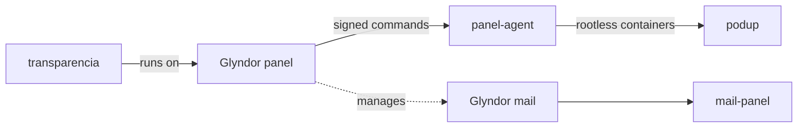

<div align="center">


# Glyndor

**Secure, self-hosted infrastructure you actually own.**

Open-source, security-first tools for self-hosters and companies who want
control without giving up security — hardened, lightweight, and built to
[OWASP ASVS Level 3](https://owasp.org/www-project-application-security-verification-standard/).

[**glyndor.net**](https://glyndor.net) · [Support](https://glyndor.net/support)

</div>

---

```console
$ whoami
Glyndor — open-source infrastructure, secure by default.

$ ls ./projects
panel/   podup/   mail/   transparencia/
```

## 🧩 Projects

| Project | What it is | Status |
|---|---|---|
| [**panel**](https://github.com/Glyndor/panel) | Secure self-hosted hosting panel — firewall, ports, SSH, containers and WireGuard tunnels | 🟡 In development |
| └ [panel-agent](https://github.com/Glyndor/panel-agent) | Hardened agent on each managed server — Ed25519-signed commands over WireGuard + mTLS | 🟢 Released · <!-- v:Glyndor/panel-agent -->v1.3.1<!-- /v --> |
| [**podup**](https://github.com/Glyndor/podup) | `docker-compose` translated to rootless Podman — Rust library + drop-in CLI | 🟢 Released · <!-- v:Glyndor/podup -->v1.8.0<!-- /v --> |
| [**mail**](https://github.com/Glyndor/mail) | Headless self-hosted mail server — SMTP/IMAP, DKIM/SPF/DMARC, API + CLI | 🟡 In development · <!-- v:Glyndor/mail -->v0.3.4<!-- /v --> |
| └ [mail-panel](https://github.com/Glyndor/mail-panel) | Next.js admin UI on top of the mail API | 🟡 In development |
| [**transparencia**](https://glyndor.net/projects/transparencia) | Public-money traceability — open data, live contracts, risk alerts | 🔵 Coming soon |

## 🔭 How it fits together



Each tool stands on its own — adopt one, or run them together.

## 🛡️ Principles

- **Secure by default** — the most restrictive configuration ships active. You opt in to looseness, never to safety. Built to ASVS Level 3.
- **You own it** — self-hosted native binaries, no SaaS lock-in.
- **Open source** — every project is public and Apache-2.0 licensed.
- **Minimal & native** — lightweight binaries, few dependencies, audited.

## 🤝 Contributing & security

- **Issues** are open to everyone — reporting bugs is welcome and valuable.
- **Pull requests** are invitation-only; this code touches kernel-level surfaces (SSH, firewall, ports).
- Report vulnerabilities **privately** — see [`SECURITY.md`](https://github.com/Glyndor/.github/blob/main/SECURITY.md).
- Branch flow, commit conventions and labels live in [`CONTRIBUTING.md`](https://github.com/Glyndor/.github/blob/main/CONTRIBUTING.md).

---

<div align="center">
<sub>Built in the open · <a href="https://glyndor.net">glyndor.net</a></sub>
</div>
